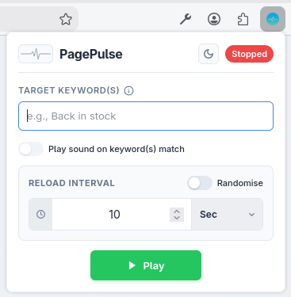
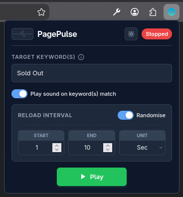
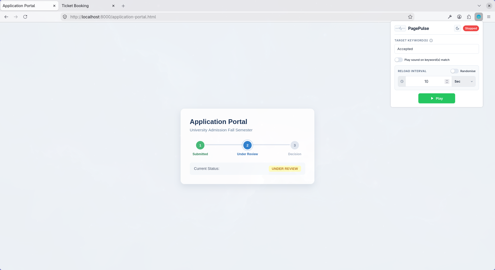
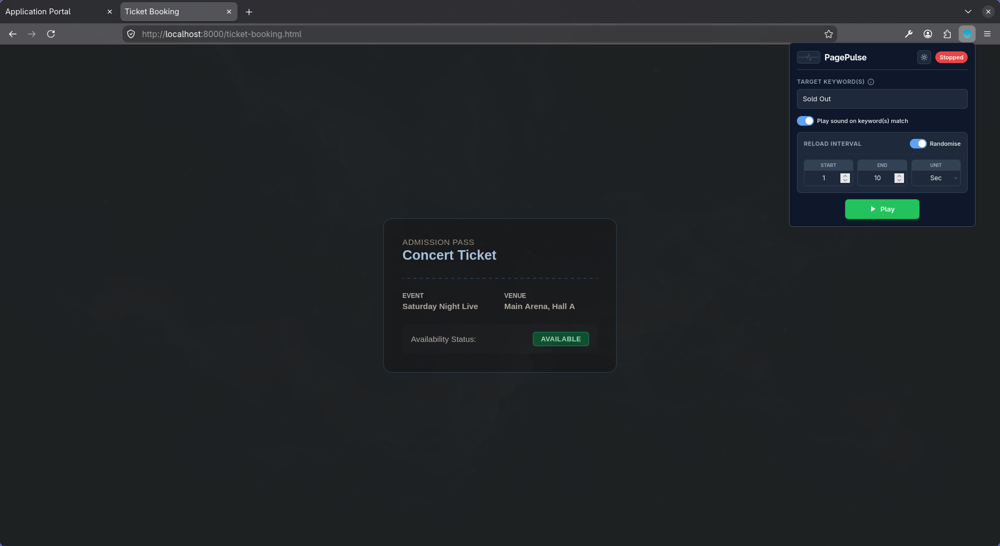
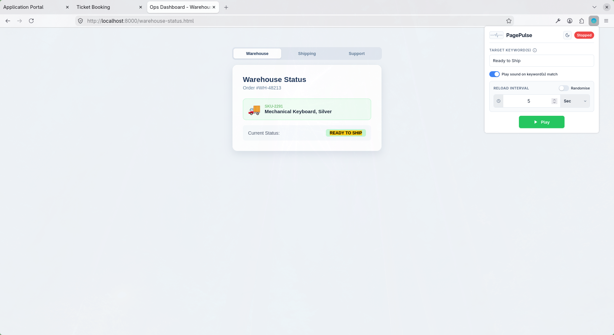
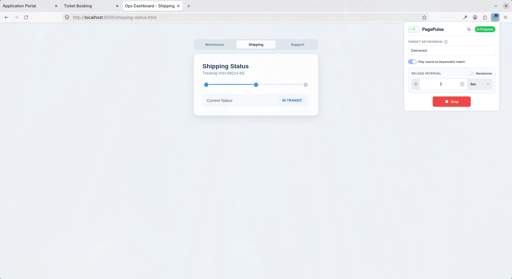
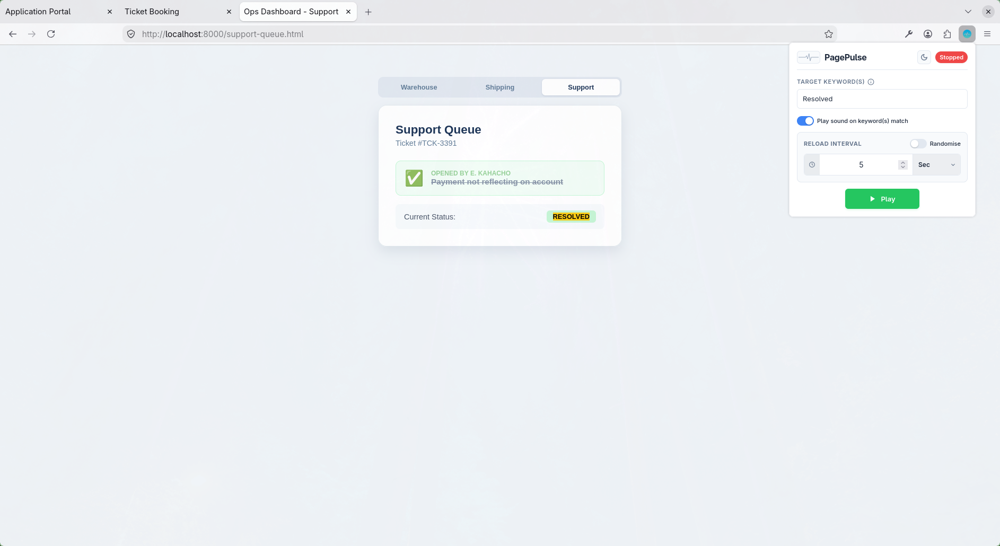

# PagePulse

A browser extension that reloads a page for you and watches for the moment something actually changes, then stops and tells you, instead of leaving you to babysit a tab.



## Browser Support

| Browser | Support | Manifest used           |
| ------- | ------- | ----------------------- |
| Chrome  | ✅      | `manifest.chrome.json`  |
| Brave   | ✅      | `manifest.chrome.json`  |
| Edge    | ✅      | `manifest.chrome.json`  |
| Firefox | ✅      | `manifest.firefox.json` |

Chrome, Brave, and Edge are all Chromium-based and share one manifest, since they agree on how a Manifest V3 background script is declared (`service_worker`). Firefox's MV3 implementation still expects the older `scripts` key instead, so it gets its own manifest, built and packaged separately via `bun run build:firefox`. See [Architecture notes](#architecture-notes) for the full reasoning.

## Why this exists

Most "auto refresh" extensions do exactly one thing: reload a tab on a timer, forever, until you remember to turn them off. That is fine if all you want is a ticking clock, but it falls apart the moment you actually care about _why_ you are refreshing: restock alerts, exam result pages, a slow-to-update dashboard, a raffle result etc. You end up either staring at the tab yourself, or setting a timer and hoping you check back at the right moment.

PagePulse was built around a different idea: tell it what you are waiting for, and let it watch for that instead of just reloading blindly.

## What it actually does

- **Reload on an interval, or a random range.** Fixed intervals are predictable; randomised ranges (e.g. "every 8 - 15 seconds") introduce natural variation between reloads. Intervals range from a minimum of 1 second to a maximum of 24 hours.
- **Watch for a keyword or phrase, and stop automatically.** Type "Back in stock" and PagePulse checks the _visible text_ of the page after every reload; not the HTML source nor the hidden elements, and stops the moment it finds a match, highlights it on the page, optionally plays a sound, and fires a system notification.
- **Remembers per page, not just per tab.** This is the part most reloaders get wrong. Open a tab, start watching `/home`, then browse to `/about` in that same tab, PagePulse pauses automatically rather than reloading whatever you happened to navigate to. Go back to `/home`, and it picks up right where it left off. Every page you have configured keeps its own settings and its own state, independently, in the same tab. See the [Ops Dashboard](#ops-dashboard) demo for a real-world example.
- **Light and Dark themes**, following your system preference by default, togglable and remembered.
- **Works across Chrome, Brave, Edge, and Firefox** from one codebase, despite the four of them disagreeing on several fairly fundamental things about how extensions are supposed to work (see [Architecture notes](#manifest-split) if you are curious how that is handled).

**Note:** _Settings are remembered per page, but an active watch isn't restored after a full browser restart. If PagePulse is mid-countdown and you quit the browser entirely (not just close the tab), the watch stops silently. Your keyword and interval are still saved for that page, so starting it again is one click, but it won't resume on its own._

### Light Mode with Fixed Time Unit and no Target Keyword(s)


### Dark Mode with Randomised Time Unit and Target Keyword(s)



## Use Cases

- Watching a product page for "In Stock" or "Add to Cart" to reappear.
- Refreshing an exam portal, application tracker, or results page until a status changes.
- Keeping an internal dashboard current without leaving it open and stale.
- Catching a limited drop, a raffle draw, or a booking slot opening up.
- Just reloading a page on a schedule, with no keyword at all, if that's all you need.

## Installation

### From Source (Development)

Fork the repo, then clone your fork via SSH:

```bash
git clone git@github.com:<your-username>/PagePulse.git
cd PagePulse
bun install
bun run dev
```

**Note:** `bun run dev` launches the popup as a normal web page for UI development.
Browser-extension APIs such as `chrome.tabs` are unavailable there. To test the actual extension functionality, build and load it as an unpacked extension as shown [below](#loading-as-an-unpacked-extension).

### Loading As an Unpacked Extension

**Chrome / Brave / Edge:**

```bash
bun run build:chrome
```

Go to `chrome://extensions` (or `brave://extensions`, `edge://extensions`), enable Developer mode, click **Load unpacked**, and select the `build/` folder.

**Firefox:**

```bash
bun run build:firefox
```

Go to `about:debugging#/runtime/this-firefox`, click **Load Temporary Add-on**, and select `build/manifest.json` directly.

## Try It Without Real Traffic

Testing an auto-reload extension against a real website means genuinely hammering someone else's server with repeated requests, not something to do casually just to check a feature works. Five small demo pages are included specifically so you (or anyone reviewing this project) can try every part of PagePulse without sending a single extra request to a site that isn't yours.

The demo pages live in `docs/demo-pages/`:

- **`application-portal.html`** - A mock university application tracker. Its status starts in one state and quietly changes to another after a handful of reloads (within about a minute of the first load). Set your target keyword to whatever the status changes _to_, and watch PagePulse catch it, highlight it, and stop.



- **`ticket-booking.html`** - A mock concert ticket page, same idea: availability starts one way and flips after a few reloads. Good for trying the randomised-interval mode, since watching an unpredictable countdown feels more natural here than on a page that updates instantly.



<a id="ops-dashboard"></a>

- **`warehouse-status.html`, `shipping-status.html`, `support-queue.html`** - A small three-page "Ops Dashboard," cross-linked by a shared tab bar. Each page tracks something different (a warehouse order, a shipment, a support ticket) and flips status after a few reloads, same as the other two demos. This trio exists specifically to show off per-page memory: start PagePulse watching one page, click through the nav bar to another (a real navigation, same tab), and watch the first watch pause automatically rather than reload whatever you clicked into. Navigate back, and it picks up exactly where it left off. Try starting all three independently to see them run side by side without interfering with each other.







**NOTE:** _All the pages reset their state on their own after about a minute of inactivity, so you can run through a demo, wait, and try again without needing to reset anything manually._

### Running Them

**Simplest: open directly in your browser:**

Just open either file from disk. If you are testing this as an actual loaded extension (not the `bun run dev` preview), make sure PagePulse has permission to run on local files, Chrome, Brave, and Edge both disable this by default for extensions. Go to the extension's **Details** page and enable **"Allow access to file URLs."** Firefox doesn't need this extra step.

**Or, for a cleaner `localhost` URL instead of a file path:**

```bash
cd docs/demo-pages
python3 -m http.server 8000
```

Then open any of the files above (e.g. `http://localhost:8000/application-portal.html`) in your browser. Keep the server running in that terminal for as long as you're testing.

## Tech Stack

- **[Svelte 5](https://svelte.dev)** (runes) for the popup UI. The extension has a single view with no routing or SSR requirements, so SvelteKit would have been unnecessary.
- **[Vite](https://vite.dev)** as the build tool, configured to output a browser-extension-shaped `build/` directory rather than a typical web app bundle.
- **[TypeScript](https://www.typescriptlang.org/)** throughout.
- **[Tailwind CSS v4](https://tailwindcss.com)** for the small amount of utility styling, alongside hand-written component CSS for the rest.
- **[Manifest V3](https://developer.chrome.com/docs/extensions/develop/migrate/what-is-mv3)**, with separate manifests for Chromium-based browsers and Firefox (they don't agree on how backgrounds are declared, [more below](#manifest-split)).
- **[Bun](https://bun.sh/)** as the package manager and script runner.

_No UI component library, no state management library, and no router. The whole popup is one component; it didn't need more than that._

## Permissions, and Why Each One is Requested

| Permission                           | Why                                                                                                                                                                             |
| ------------------------------------ | ------------------------------------------------------------------------------------------------------------------------------------------------------------------------------- |
| `tabs`                               | Reading which tab/page is active, so the right page gets watched                                                                                                                |
| `activeTab`                          | Baseline access to the current tab when the popup is used                                                                                                                       |
| `scripting`                          | Injecting the keyword-check into the page after each reload                                                                                                                     |
| `host_permissions: <all_urls>`       | Required so the keyword check can run on any page the user chooses. Browser-internal and extension-store pages are explicitly excluded because scripts cannot be executed there |
| `notifications`                      | The "Match Found" system notification                                                                                                                                           |
| `storage`                            | Remembering settings per page, and your theme preference                                                                                                                        |
| `offscreen` (Chrome/Brave/Edge only) | MV3 service workers can't play audio directly, this is the sanctioned workaround                                                                                                |

## Architecture Notes

A few decisions here weren't obvious going in, thus noting them for anyone reading the code:

- **State is keyed by tab _and_ page, not just tab.** A `tabId` alone can't distinguish "watching `/home`" from "watching `/about`" once you have navigated within the same tab, so every watch is keyed by `tabId + normalized URL`.
- **The reload loop is a self-rescheduling `setTimeout`, not `setInterval`.** An interval fires on a fixed clock regardless of whether the previous reload-and-check cycle actually finished; on a slow page, that lets cycles overlap. Waiting for each cycle to complete before scheduling the next keeps everything strictly sequential.
- **Keyword detection reads the page's full visible text, not node-by-node.** A phrase like "Buy Now" is often split across separate elements by inline markup (`<b>Buy</b> Now`), checking one text node at a time misses matches that are visibly on the page but not contained in any single node.
  <a id="manifest-split"></a>
- **Chromium-based browsers (e.g. Chrome, Brave, and Edge) and Firefox need different `background` manifest keys.** Chromium's MV3 wants `service_worker`; Firefox's MV3 implementation still expects `scripts`. Two manifests, generated from the same `background.js`, resolved at build time via `build:chrome` / `build:firefox`.

## Roadmap / Ideas Not Yet Built

PagePulse does what I need it to do. There is no active feature roadmap, and that is intentional. Browser support also follows the same principle. PagePulse is built, tested, and maintained against Chrome, Brave, Edge, and Firefox, and that is the intended scope going forward, not a starting point I plan to expand.

Other Chromium-based browsers (Opera, for instance) can generally install PagePulse directly from the Chrome Web Store, since they share the same extension platform, but I haven't tested them myself and can't promise they behave identically.

Every new capability tends to want a new permission attached to it, and permission changes mean a fresh review cycle on every store this is listed on. Keeping the permission footprint small and stable is a feature in itself, not an oversight.

## Contributing

Issues and PRs are welcome, but scoped to bug fixes, cross-browser quirks, and small robustness improvements, not new features. This isn't a lack of interest in ideas, it is a deliberate boundary so the extension stays lean and doesn't slowly accumulate permissions nobody asked for by default.

If there is a feature you want that PagePulse doesn't have, forking is an entirely reasonable path rather than a fallback. The code is small, well documented, and MIT-licensed specifically so someone can take it in their own direction without waiting on me. Forking is genuinely welcome under the MIT license; if you do build on this, a mention or link back is appreciated but not required.

## License

PagePulse is licensed under the terms of the MIT license. See [LICENSE](LICENSE).

## Third-Party Assets

PagePulse uses a small number of third-party assets: an icon and a notification sound, each used under their respective free licenses, with full attribution. See [THIRD PARTY.md](THIRD_PARTY.md) for details.

## Privacy

PagePulse collects no data of any kind, everything runs and stays entirely on your own device. See [PRIVACY.md](PRIVACY.md) for the full breakdown of what that means and why.
